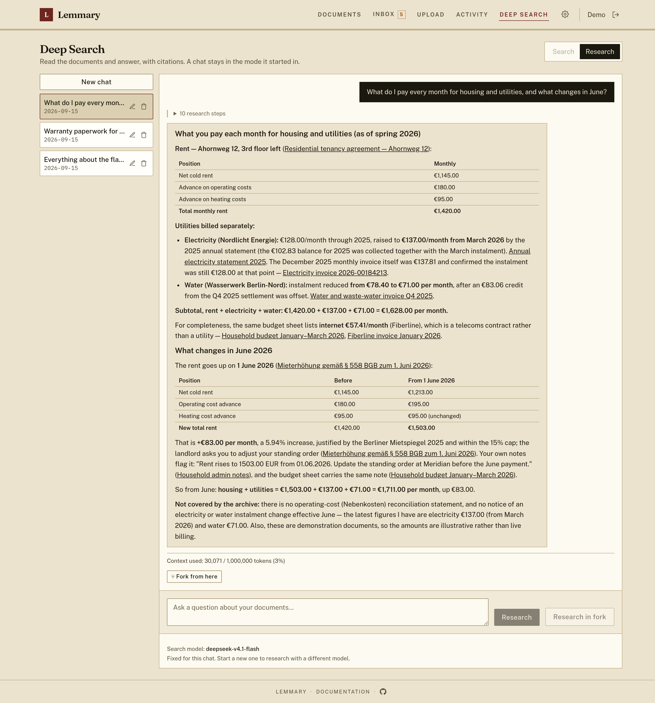
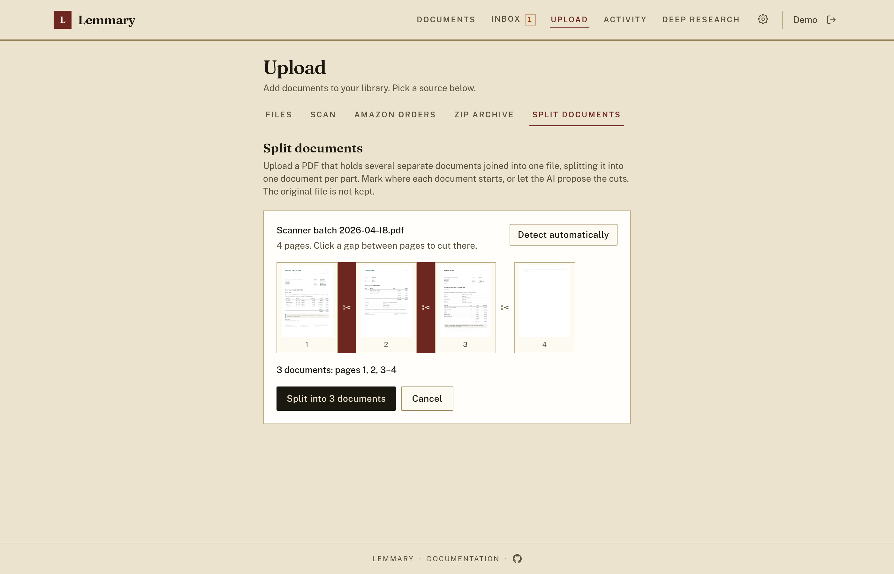
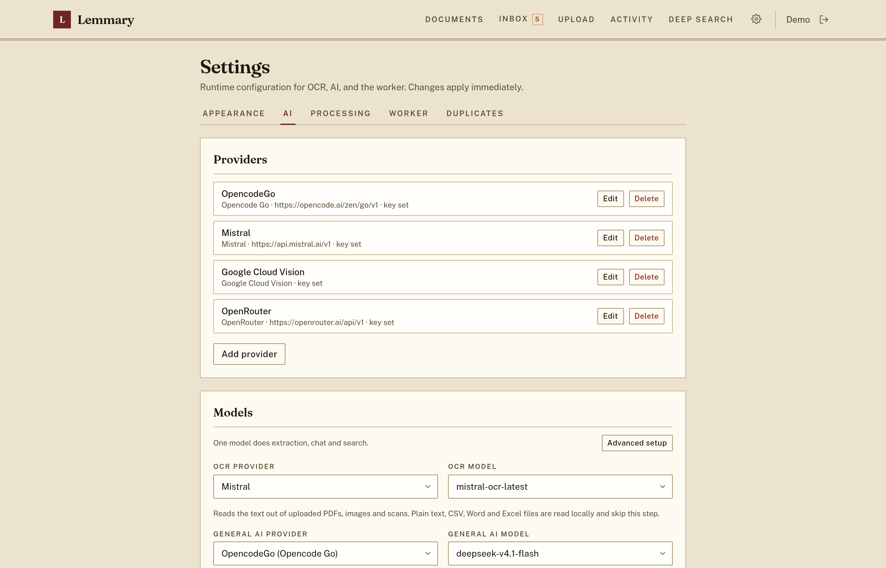

# Lemmary

Document storage built with Go + PocketBase and a React + TanStack Router frontend. Upload documents, run OCR, extract metadata with an OpenAI-compatible AI provider, and review results in the UI.

## Paperless-ngx compatibility

Lemmary implements a [paperless-ngx](https://github.com/paperless-ngx/paperless-ngx)-compatible REST API under `/api/`, so you can use third-party clients instead of (or alongside) the built-in web UI. Coverage is partial — document list/upload/download, tags, metadata, and the document list's search and filters generally work, but not every paperless-ngx endpoint or feature is implemented.

The API has been tested with the [swift-paperless](https://github.com/paulgessinger/swift-paperless) iOS app and mostly works for browsing and uploading documents. See [docs/setup.md](docs/setup.md#paperless-ngx-api-compatibility) for connecting external clients.

## Features

- Upload PDF, image, plain text, CSV, Word (.docx), or Excel (.xlsx) documents
- Full backup and restore: download your whole library — files, OCR text, metadata, thumbnails and taxonomy — as one zip, and restore it into this or another instance
- Optional encryption at rest: the volume holds only ciphertext, the instance boots locked until someone signs in, and nobody but your own accounts can unlock it — see [docs/encryption.md](docs/encryption.md)
- Import the invoice PDFs from an Amazon "Your Orders" data export (**Upload → Amazon orders**); the archive is previewed and only imported after you confirm the file count, duplicates are skipped
- Async processing jobs with status tracking
- OCR text extraction (native text extraction for TXT/CSV/DOCX/XLSX)
- AI metadata extraction: title, purpose, date, type, tags, summary
- Document list with full-text search and status filters
- Deep Search chat in two modes, one per path: **Search** (`/rag/search`) finds documents and lists them as cards; **Research** (`/rag/research`) searches, reads the documents it finds, surveys hundreds at once through a helper model, counts and totals, and answers with links to its sources — streaming each step as it works; a run that outgrows the model's context window fails with the provider's error; chats are saved, listed in a sidebar, and resumable by URL
- Detail page for reviewing OCR text and correcting metadata
- Passkey sign-in: register a passkey per device and sign in with a fingerprint, face, or device PIN — no password typed, alongside the existing password and OAuth2 options
- Admin Settings page for runtime OCR/AI/worker config
- First-launch setup wizard (admin account + required OCR/AI keys)

### Screenshots

Every screen has one in [docs/screenshots.md](docs/screenshots.md). The library
in all of them is a demo archive of invented documents, so nothing in these
images belongs to anybody. A few to start with:

Documents list with AI-extracted titles, summaries, and tags, and a timeline
that counts the archive by month:


Document detail with editable metadata, summary, and OCR text. Fields the model
wrote in the document's own language keep the original under the translation:


Deep Search in **Search** mode — a natural-language query, and the documents it
matched:


Deep Search in **Research** mode — the same archive read rather than listed,
answered with links to the documents each figure came from:



Split a scanner's multi-document PDF back into one document per part, by hand or
with the cuts the model proposes:



Admin Settings: providers, models and worker timeouts as runtime configuration:



## Stack

- **Backend:** Go, [PocketBase as a framework](https://pocketbase.io/docs/use-as-framework/)
- **Frontend:** React, TanStack Router, PocketBase JS SDK
- **OCR:** Mistral Document OCR (`mistral`), Google Cloud Vision (`google_vision`), or a file-capable OpenAI/OpenRouter model, configured in Settings
- **AI:** OpenAI-compatible chat completions (Mistral, OpenAI, or OpenRouter) via the official OpenAI Go SDK — see [docs/ai_providers.md](docs/ai_providers.md)
- **Search:** [Bleve](https://github.com/blevesearch/bleve) full-text index (token AND for the search box, relaxed to most-terms for the agent, BM25 ranking) over titles, OCR, tags, and metadata
- **Deep Search:** natural-language archive search via a tool-calling agent over that index (hybrid keyword and embedding retrieval; keyword expansion across configured languages when no embedding model is set), in two modes — **Search** lists matching documents, **Research** reads them, surveys and counts across the archive with a cheaper helper model, and writes a cited answer

## Project layout

```text
backend/    PocketBase app, migrations, OCR/AI worker
frontend/   React UI
docs/       Setup and operation guides
```

## Quick start

```bash
cp .env.example .env
# Optional: seed OCR/AI keys in .env for first boot (skips those wizard steps)
docker compose up -d
```

Open [http://127.0.0.1:8090](http://127.0.0.1:8090). On first launch, the in-app setup wizard creates your admin account and collects OCR + LLM API keys (hard gate until both are set). A single Mistral key covers OCR, extraction and embeddings. Data is stored in a Docker volume (`app_data`).

Volumes, reverse proxies, backups and upgrades: [docs/self_hosting.md](docs/self_hosting.md). To run without Docker, see [docs/setup.md](docs/setup.md).

## Environment variables and Settings

[docs/setup.md](docs/setup.md) has the full list; [docs/ai_providers.md](docs/ai_providers.md) covers the AI ones.

- `WORKER_CRON_EXPR`, the `LIMIT_*` family, `VAULT_*` and the frontend's `VITE_*` stay in `.env`
- OCR/AI keys, models and worker timeouts live in the DB (`app_settings`). `AI_API_KEY` plus `SETUP_ADMIN_EMAIL`/`SETUP_ADMIN_PASSWORD` in `.env` bring a fresh instance up with nothing to answer; otherwise the first-launch wizard collects them. Either way **Settings** is authoritative afterwards
- `AI_MANAGED=1` inverts that for a hosted fleet: the environment is re-applied on every boot and the tenant's Settings page has no Providers, Models or Duplicates sections

## Tests

Unit tests live beside the code they cover:

```bash
cd backend && go test -tags vectors ./... -count=1
cd frontend && pnpm test
```

The `vectors` tag is not optional: bleve's vector search is a cgo binding to
blevesearch's FAISS fork, and the backend does not build without it. FAISS is
needed on this machine only for Go commands run here, since the verification
image the overlay builds carries its own. Installing it is a one-off, and the
shortest route needs no compiler at all:

```bash
docker buildx build --target faiss --output type=local,dest=./.faiss .
mkdir -p "$HOME/.local/faiss" && cp -a .faiss/lib .faiss/include "$HOME/.local/faiss/"
```

With [direnv](https://direnv.net), `direnv allow` then points the toolchain at
it and sets the tag for you. The other two routes — building it into
`/usr/local` or into your home directory with `scripts/faiss-build.sh` — are in
[docs/setup.md](docs/setup.md#faiss-required-to-build-the-backend), along with
the packages each one needs.

The end-to-end suites, the dev runner and the full verification stack live in a
separate private repository and are not part of this one. `./scripts/test-all.sh`
requires that overlay; without it the command fails.

## License

Lemmary is **source-available**, not open source. It is licensed under the
[PolyForm Noncommercial License 1.0.0](https://polyformproject.org/licenses/noncommercial/1.0.0)
(see [LICENSE](LICENSE)).

| | |
| --- | --- |
| ✅ Allowed | Self-hosting for personal or household use; hobby projects, research, study; use by charities, schools, public research, public safety/health, environmental, and government organizations; reading, forking, modifying, and redistributing the source |
| ❌ Not allowed without a commercial license | Use by or on behalf of a business; offering Lemmary to third parties as a hosted or paid service; bundling it into a commercial product |

For commercial licensing, contact Alexander Arutyunov <licensing@lemmary.app>.

## Recommended: Opencode Go

[Opencode Go](https://opencode.ai/go?ref=84VDFS18QN) is a perfect plan to use with this project as AI provider. See the [docs](https://opencode.ai/docs/go/).
