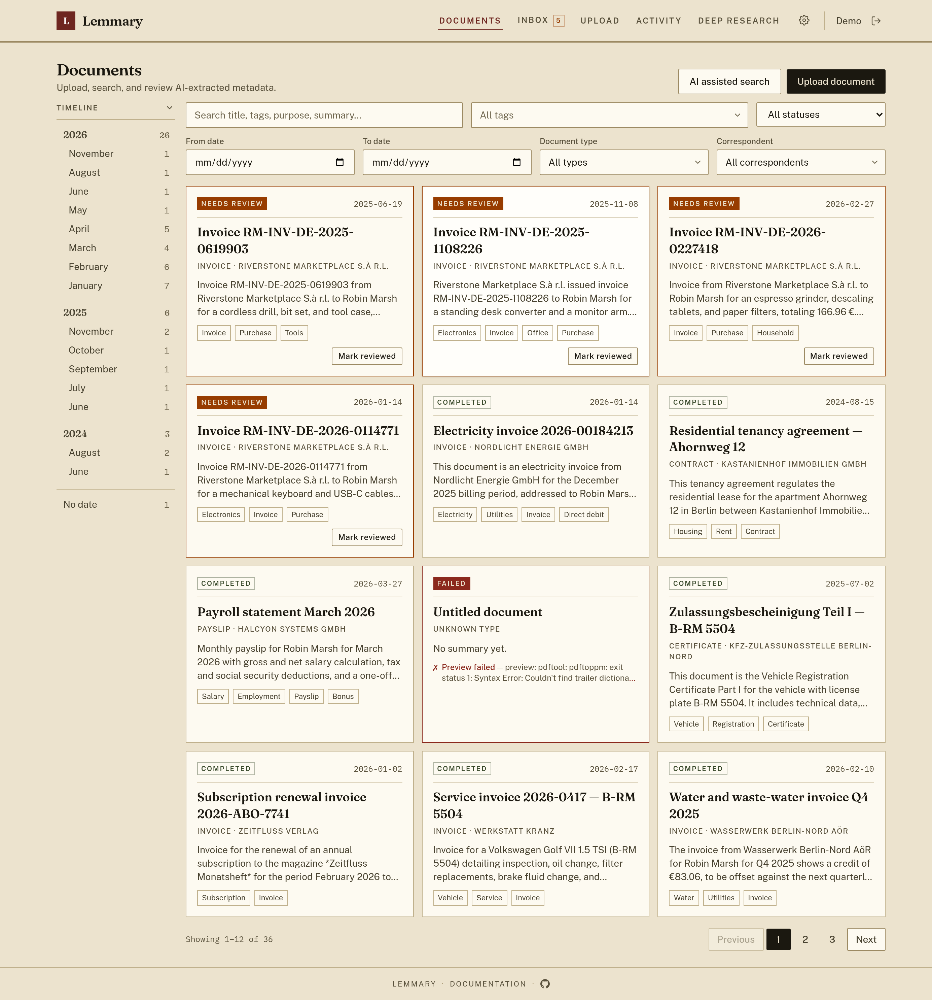
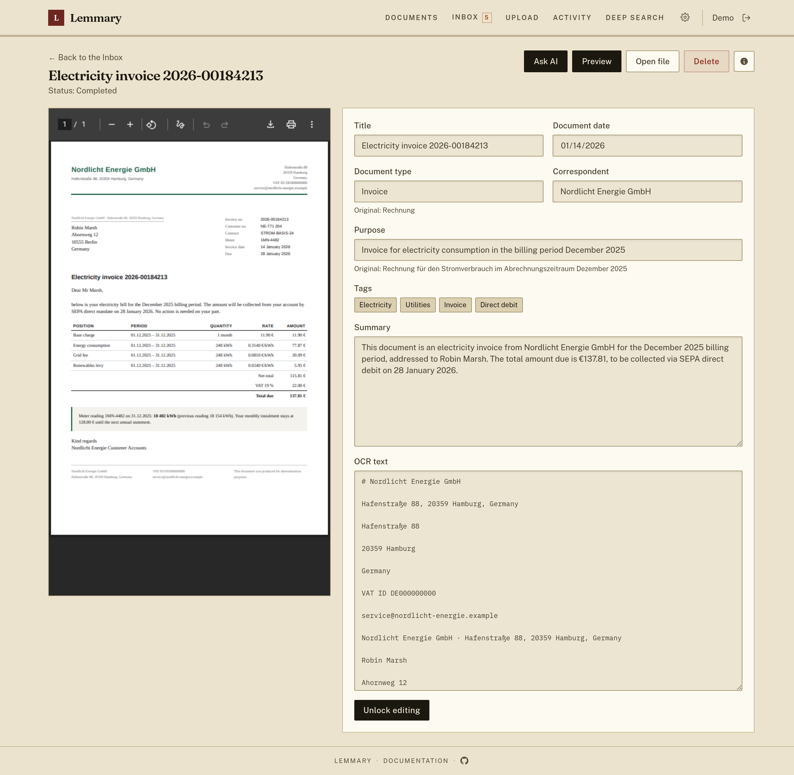
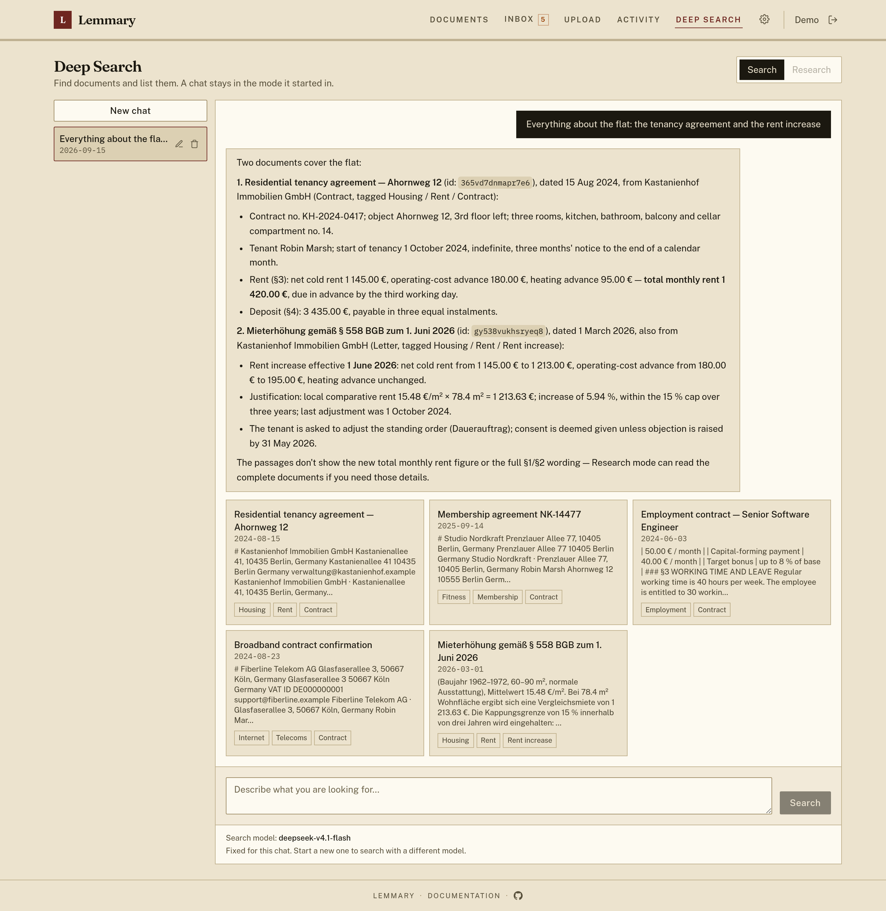

# Lemmary

Document storage built with Go + PocketBase and a React + TanStack Router frontend. Upload documents, run OCR, extract metadata with an OpenAI-compatible AI provider, and review results in the UI.

## Paperless-ngx compatibility

Lemmary implements a [paperless-ngx](https://github.com/paperless-ngx/paperless-ngx)-compatible REST API under `/api/`, so you can use third-party clients instead of (or alongside) the built-in web UI. Coverage is partial — document list/upload/download, tags, and metadata generally work, but not every paperless-ngx endpoint or feature is implemented.

The API has been tested with the [swift-paperless](https://github.com/paulgessinger/swift-paperless) iOS app and mostly works for browsing and uploading documents. See [docs/setup.md](docs/setup.md#paperless-ngx-api-compatibility) for connecting external clients.

## Stack

- **Backend:** Go, [PocketBase as a framework](https://pocketbase.io/docs/use-as-framework/)
- **Frontend:** React, TanStack Router, PocketBase JS SDK
- **OCR:** Google Cloud Vision (`google_vision`) or Mistral Document OCR (`mistral`), configured in Settings
- **AI:** OpenAI-compatible chat completions (OpenAI, OpenRouter, or Mistral) via the official OpenAI Go SDK
- **Search:** [Bleve](https://github.com/blevesearch/bleve) full-text index (token AND, BM25 ranking) over titles, OCR, tags, and metadata
- **Deep Search:** natural-language archive search via a tool-calling agent over that index (keyword expansion across configured languages)

## Project layout

```text
backend/    PocketBase app, migrations, OCR/AI worker
frontend/   React UI
docs/       Setup and operation guides
```

## Quick start

```bash
cp .env.example .env
# Optional: seed OCR/AI keys in .env for first boot (skips those wizard steps)
docker compose up --build
```

Open [http://127.0.0.1:8090](http://127.0.0.1:8090). On first launch, the in-app setup wizard creates your admin account and collects OCR + LLM API keys (hard gate until both are set). A single Mistral key can cover OCR and extraction. Data is stored in a Docker volume (`app_data`).

To run without Docker, see [docs/setup.md](docs/setup.md).

## Environment variables and Settings

See [docs/setup.md](docs/setup.md) for the full list.

- `WORKER_CRON_EXPR` and frontend `VITE_*` vars stay in `.env`
- OCR/AI keys, models, and worker timeouts live in the DB (`app_settings`); seed from `.env` on first boot, complete via the first-launch wizard, then edit in **Settings** as admin

## Features

- Upload PDF, image, plain text, CSV, Word (.docx), or Excel (.xlsx) documents
- Full backup and restore: download your whole library — files, OCR text, metadata, thumbnails and taxonomy — as one zip, and restore it into this or another instance
- Optional encryption at rest: the volume holds only ciphertext, the instance boots locked until someone signs in, and nobody but your own accounts can unlock it — see [docs/encryption.md](docs/encryption.md)
- Import the invoice PDFs from an Amazon "Your Orders" data export (**Upload → Amazon orders**); the archive is previewed and only imported after you confirm the file count, duplicates are skipped
- Async processing jobs with status tracking
- OCR text extraction (native text extraction for TXT/CSV/DOCX/XLSX)
- AI metadata extraction: title, purpose, date, type, tags, summary
- Document list with full-text search and status filters
- Deep Search chat (`/search`) with optional multi-step refine mode
- Detail page for reviewing OCR text and correcting metadata
- Passkey sign-in: register a passkey per device and sign in with a fingerprint, face, or device PIN — no password typed, alongside the existing password and OAuth2 options
- Admin Settings page for runtime OCR/AI/worker config
- First-launch setup wizard (admin account + required OCR/AI keys)

### Screenshots

Documents list with AI-extracted titles, summaries, and tags:



Document detail with editable metadata, summary, and OCR text:



Deep Search with natural-language queries:



## Tests

Unit tests live beside the code they cover:

```bash
cd backend && go test ./... -count=1
cd frontend && pnpm test
```

The end-to-end suites, the dev runner and the full verification stack live in a
separate private repository and are not part of this one. `./scripts/test-all.sh`
runs everything available here either way, and reports which suites it could
not run.

## License

Lemmary is **source-available**, not open source. It is licensed under the
[PolyForm Noncommercial License 1.0.0](https://polyformproject.org/licenses/noncommercial/1.0.0)
(see [LICENSE](LICENSE)).

| | |
| --- | --- |
| ✅ Allowed | Self-hosting for personal or household use; hobby projects, research, study; use by charities, schools, public research, public safety/health, environmental, and government organizations; reading, forking, modifying, and redistributing the source |
| ❌ Not allowed without a commercial license | Use by or on behalf of a business; offering Lemmary to third parties as a hosted or paid service; bundling it into a commercial product |

For commercial licensing, contact Alexander Arutyunov <licensing@lemmary.app>.

## Recommended: Opencode Go

[Opencode Go](https://opencode.ai/go?ref=84VDFS18QN) is a perfect plan to use with this project as AI provider. See the [docs](https://opencode.ai/docs/go/).
