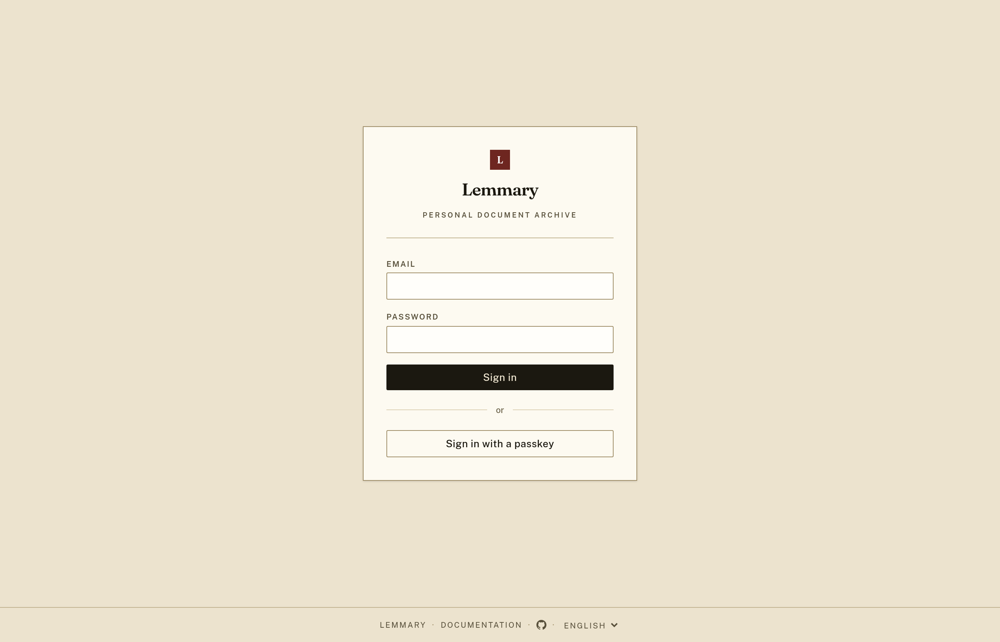

# Anmeldung per OAuth2 / SSO {#oauth2-sso-sign-in}

Der Anmeldebildschirm spiegelt wider, was die PocketBase-Collection `users` akzeptiert. Aktivieren Sie dort einen
OAuth2-Anbieter, und neben dem Formular für E-Mail und Passwort erscheint eine Schaltfläche **Weiter mit …** –
ohne Neubau und ohne Umgebungsvariable.



---

## Schritt 1: Einen Anbieter in PocketBase aktivieren {#step-1-enable-a-provider-in-pocketbase}

1. Öffnen Sie die PocketBase-Admin-Oberfläche (den Eintrag **Admin** im Menü **Mehr** der App oder
   `/_/` auf dem Server) und melden Sie sich mit dem bei der Einrichtung erstellten Administratorkonto an.
2. Gehen Sie zu **Collections → users → Options → OAuth2**.
3. Schalten Sie **Enable** ein und fügen Sie einen Anbieter hinzu (Google, GitHub, OIDC, …).
4. Tragen Sie **Client ID** und **Client secret** aus der Konsole des Anbieters ein und
   registrieren Sie die Weiterleitungs-URL von PocketBase bei diesem Anbieter:

   ```
   https://<your-app-host>/api/oauth2-redirect
   ```

5. Speichern Sie die Collection und laden Sie dann den Anmeldebildschirm der App neu.

Jeder aktivierte Anbieter erhält eine eigene Schaltfläche, beschriftet mit seinem Anzeigenamen.
Die Anmeldung erfolgt in einem Pop-up-Fenster; die App übernimmt die Sitzung, sobald es sich schließt.

---

## Schritt 2: Dem Konto einen Benutzerdatensatz geben {#step-2-give-the-account-a-user-record}

Die Collection `users` hat keine Create-Regel – diese App bietet keine Selbstregistrierung –, daher kann OAuth2
Konten anmelden, die **bereits existieren**, aber keine neuen anlegen. PocketBase gleicht die E-Mail-Adresse
des Anbieters mit vorhandenen `users`-Datensätzen ab, daher gilt:

- Das bei der Einrichtung erstellte Administratorkonto kann sich sofort per OAuth2 anmelden, sofern
  das Anbieterkonto dieselbe E-Mail-Adresse verwendet.
- Für alle anderen legen Sie den Benutzer zuerst an: **Collections → users → New record**, mit der
  E-Mail-Adresse, die dieses Anbieterkonto meldet. Das dort gesetzte Passwort wird für die
  OAuth2-Anmeldung nie verwendet.

Ein Konto ohne passenden `users`-Datensatz erhält von PocketBase `Failed to authenticate.`, was der
Anmeldebildschirm zusammen mit diesem Hinweis meldet.

---

## Optional: Nur OAuth2 {#optional-oauth2-only}

Wenn Sie **Identity/password** unter **Collections → users → Options** ausschalten, wird das Formular für E-Mail
und Passwort ausgeblendet, und nur die Anbieter-Schaltflächen bleiben. Zwei Dinge sollten Sie vorher wissen:

- Administratoren behalten einen Zugang über die PocketBase-Admin-Oberfläche unter `/_/`, die sich
  gegen `_superusers` authentifiziert und von dieser Einstellung nicht betroffen ist.
- Die App zeigt das Passwortformular weiterhin an, wenn Sie identity/password deaktivieren *und* keinen
  OAuth2-Anbieter aktiviert lassen, sodass die Einstellung niemanden aussperren kann.

---

## Siehe auch {#see-also}

[Anmeldung mit Passkey](/de/passkeys) – mit Fingerabdruck, Gesicht oder Geräte-PIN statt mit einem
Passwort anmelden. Sie benötigt keinen externen Anbieter und funktioniert neben OAuth2 und dem Passwortformular.
Beachten Sie: Wenn Sie identity/password ausschalten, zählt ein Passkey als Zugang: Lemmary verweigert dann
das Löschen des letzten Passkeys eines Kontos, wenn sonst nichts mehr übrig bleibt.
