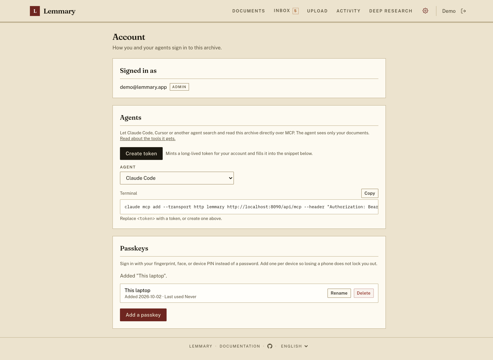

# Anmeldung mit Passkey {#passkey-sign-in}

Ein Passkey ersetzt Ihr Passwort durch die Entsperrmethode, die Sie auf dem Gerät ohnehin verwenden – Fingerabdruck,
Gesicht oder Geräte-PIN. Er kann nicht durch Phishing abgegriffen oder auf einer anderen Website wiederverwendet werden,
er benötigt keinen externen Dienst und funktioniert neben dem Formular für E-Mail und Passwort und jedem
[OAuth2-Anbieter](/de/oauth), den Sie aktiviert haben. Durch das Einschalten wird nichts entfernt.

Auf dem Anmeldebildschirm ist es eine einzige Schaltfläche: **Mit einem Passkey anmelden**. Sie geben keine E-Mail-Adresse
ein – der Authenticator weiß, zu welchem Konto der Passkey gehört.

Die Registrierung finden Sie unter **Mehr → Konto**, ein Passkey pro Gerät.

---

## Voraussetzungen {#requirements}

Browser führen einen Passkey-Vorgang nur für einen **Hostnamen** aus, der über eine **sichere Verbindung** ausgeliefert wird:

- `https://archive.example.com` – funktioniert.
- `http://localhost:8090` – funktioniert. `localhost` ist die einzige Ausnahme, die Browser machen.
- `http://192.168.1.10:8090` – **funktioniert nicht**, ebenso wenig `https://192.168.1.10`. Ein
  Passkey ist an einen Domainnamen gebunden, daher kann eine IP-Adresse nie verwendet werden, ob mit HTTPS oder ohne.
- `http://archive.example.com` – funktioniert nicht. Reines HTTP auf einem echten Hostnamen ist kein sicherer
  Kontext.

Ihr Authenticator muss außerdem **Sie** verifizieren können, nicht nur feststellen, dass er vorhanden ist: per
Fingerabdruck, Gesicht oder PIN. Erst das macht einen Passkey zu einem angemessenen Ersatz für ein Passwort
und nicht zu einem Schlüssel, den jeder benutzen könnte, der Ihr Gerät in der Hand hat. Ein Hardware-Sicherheitsschlüssel
ohne gesetzte PIN kann nicht registriert werden – setzen Sie zuerst eine PIN darauf.

Wo ein Passkey nicht verwendet werden kann, erscheint die Schaltfläche einfach nicht, und das Passwortformular ist
nicht betroffen. Unter **Mehr → Konto** erfahren Sie, welche der Bedingungen nicht erfüllt ist.

Beachten Sie, dass die Standardadresse der App, `http://127.0.0.1:8090`, zwar ein sicherer Kontext, aber
dennoch eine IP-Adresse ist. Öffnen Sie stattdessen `http://localhost:8090`.

---

## Hinter einem Reverse Proxy {#behind-a-reverse-proxy}

Standardmäßig leitet Lemmary alles aus der Anfrage ab, die es erhält: Die Relying-Party-ID ist
der Hostname (ohne Port), und der akzeptierte Origin besteht aus Schema und Host, über die die Anfrage
eingegangen ist. Das ist immer dann korrekt, wenn der Proxy den ursprünglichen `Host` weiterleitet; außerdem wird
`X-Forwarded-Proto` ausgewertet, um zu erkennen, dass der Browser HTTPS verwendet hat.

Setzen Sie diese beiden nur, wenn das nicht ausreicht:

| Variable | Bedeutung |
| --- | --- |
| `PASSKEY_RP_ID` | Die Relying-Party-ID: ein reiner Domainname, ohne Schema und ohne Port. Setzen Sie sie, wenn der Proxy den öffentlichen `Host` nicht weiterleitet, oder um eine übergeordnete Domain festzulegen (`example.com`, während `app.example.com` ausgeliefert wird). |
| `PASSKEY_ORIGINS` | Kommagetrennte vollständige Origins (Schema, Host und Port), die einen Vorgang abschließen dürfen, z. B. `https://archive.example.com,https://www.archive.example.com`. Setzen Sie sie, wenn die App unter mehr als einem Origin erreichbar ist oder wenn der Proxy TLS terminiert, ohne `X-Forwarded-Proto` zu setzen. |

Beide werden aus der Umgebung gelesen, nicht aus den **Einstellungen**. Siehe
[Umgebungsvariablen](/de/setup#environment-variables).

Seite und API müssen keinen gemeinsamen Origin haben. Wenn der Browser einen `Origin`-Header sendet,
dessen Host die Relying Party (oder eine Subdomain davon) ist, wird dieser Origin ebenfalls akzeptiert – genau
das ermöglicht es, dass ein aufgeteiltes Entwicklungs-Setup mit der SPA auf einem Port und der API auf einem anderen
ohne jede Konfiguration funktioniert.

---

## Wenn sich der Hostname ändert, funktionieren Passkeys nicht mehr {#if-the-hostname-changes-passkeys-stop-working}

Das ist das Einzige, was Sie vorab wissen sollten. **Jeder Passkey ist dauerhaft an den
Hostnamen gebunden, unter dem er erstellt wurde.** Eine Installation von `http://localhost:8090` nach
`https://archive.example.com` umzuziehen, `PASSKEY_RP_ID` zu ändern oder dieselbe Installation über zwei
verschiedene Hostnamen zu erreichen, hat jeweils dieselbe Folge: Die unter dem alten Namen registrierten Passkeys
können unter dem neuen nicht verwendet werden und müssen erneut hinzugefügt werden.

Sie gehen nicht stillschweigend verloren – melden Sie sich mit E-Mail und Passwort an, löschen Sie die veralteten Einträge
unter **Mehr → Konto** und fügen Sie einen neuen Passkey hinzu.

---

## Schritt 1: Einen Passkey bei der Ersteinrichtung hinzufügen {#step-1-add-a-passkey-during-first-launch-setup}

Der Einrichtungsassistent bietet **Passkey hinzufügen** direkt an, nachdem er Ihr Administratorkonto erstellt hat.
Das ist optional; **Vorerst überspringen** führt direkt weiter zu den Anbieter-Schritten, und das Angebot erscheint
nicht wieder. Auf einer Adresse, unter der kein Passkey erstellt werden kann, wird der Schritt vollständig ausgeblendet.

---

## Schritt 2: Einen Passkey später hinzufügen {#step-2-add-a-passkey-later}

1. Öffnen Sie **Mehr → Konto**.
2. Wählen Sie unter **Passkeys** die Option **Passkey hinzufügen**.
3. Geben Sie ihm einen Namen, den Sie wiedererkennen – das Feld ist mit einer Vermutung wie
   *Chrome on Windows* vorausgefüllt. Der Name ist eine Bezeichnung von Lemmary selbst; Ihr Gerät zeigt ihn nicht an.
4. Bestätigen Sie mit Fingerabdruck, Gesicht oder PIN.

Fügen Sie einen pro Gerät hinzu. Lemmary bietet keine Selbstregistrierung, daher kann ein Passkey nur einem
bereits bestehenden Konto hinzugefügt werden – dieselbe Einschränkung, die auch für [OAuth2](/de/oauth) gilt.

---

## Passkeys verwalten {#managing-passkeys}

**Mehr → Konto** listet jeden Passkey Ihres Kontos mit dem Datum auf, an dem er hinzugefügt wurde, und wann er
zuletzt verwendet wurde. Sie können jeden davon umbenennen oder entfernen.

Das Entfernen eines Passkeys hier entfernt nicht den Eintrag, den Ihr Browser oder Betriebssystem in
seinem eigenen Schlüsselbund aufbewahrt, und das Löschen dort entfernt ihn nicht hier. Wenn ein Passkey auf Ihrem
Gerät verschwunden ist, löschen Sie ihn auch in Lemmary, damit die Liste stimmt.

Das Löschen Ihres letzten Passkeys ist erlaubt, denn die Anmeldung mit E-Mail und Passwort ist weiterhin vorhanden.
Der einzige Fall, in dem Lemmary ablehnt, ist ein Konto, das *keinen anderen Zugang* hat – identity/password
in PocketBase ausgeschaltet und kein OAuth2-Anbieter verknüpft. Fügen Sie zuerst ein Passwort oder einen weiteren
Passkey hinzu.

---

## Hinweise {#notes}

- Ein Passkey ist hier eine **primäre** Anmeldemethode, kein zweiter Faktor. Es gibt keinen
  Schritt „Passwort plus Passkey“, und Passkeys sind nicht mit der eigenen MFA von PocketBase verbunden.
- Der Eintrag **Admin** (die eigene Oberfläche von PocketBase unter `/_/`) authentifiziert immer mit dem
  Superuser-Passwort. Passkeys werden für die Collection `users` registriert, sodass sich ein Administrator durch einen
  Fehler mit Passkeys nie vom Server aussperren kann.
- Passkeys sind **nicht** Teil eines Bibliotheksexports. Der Export ist ein portables Archiv Ihrer
  Dokumente; ein Passkey ist an einen Hostnamen und an Hardware gebunden, daher könnte sich eine wiederhergestellte
  Kopie nie authentifizieren und würde die Liste nur überladen. Eine vollständige PocketBase-Sicherung (**Admin → Settings →
  Backups**) enthält sie dagegen, und das ist der richtige Weg – beim Wiederherstellen einer solchen Sicherung läuft die
  Installation wieder unter demselben Hostnamen.
- Paperless-ngx-Clients melden sich weiterhin mit Benutzername und Passwort an. Ein WebAuthn-Vorgang
  benötigt einen Browser, daher gibt es für diese API nichts hinzuzufügen.

---

## Fehlerbehebung {#troubleshooting}

**Die Passkey-Schaltfläche fehlt auf dem Anmeldebildschirm.** Entweder kann die Adresse keinen Passkey tragen
(siehe [Voraussetzungen](#requirements)), oder es hat noch niemand einen registriert. Melden Sie sich mit Ihrem Passwort an
und fügen Sie einen unter **Mehr → Konto** hinzu.

**"Passkeys need a hostname, not an IP address."** Sie greifen per IP auf die App zu. Verwenden Sie ihren
Hostnamen, oder setzen Sie `PASSKEY_RP_ID` und `PASSKEY_ORIGINS`.

**"Passkeys need the hostname localhost rather than a loopback IP address."** Öffnen Sie
`http://localhost:8090` statt `http://127.0.0.1:8090`.

**„Die Anmeldung mit Passkey wurde abgebrochen oder ist abgelaufen.“** Die Abfrage wurde geschlossen oder zu lange
offen gelassen. Eine geräteübergreifende Anmeldung per QR-Code kann eine Weile dauern – das ist normal, und die
Schaltfläche wartet weiter.

**„Dieses Gerät hat bereits einen Passkey für dieses Konto.“** Nichts zu tun; verwenden Sie den vorhandenen,
oder entfernen Sie ihn zuerst unter **Mehr → Konto**.

**„Dieses Gerät kann noch keinen Passkey erstellen.“** Auf dem Authenticator ist keine Bildschirmsperre, keine
Biometrie und keine PIN eingerichtet. Richten Sie eine ein und versuchen Sie es erneut – Lemmary verlangt dies, weil
der Passkey Ihr Passwort ersetzt.

**"Too many sign-in attempts are in progress."** Der Server hält so viele halb abgeschlossene
Vorgänge vor, wie er zulässt. Warten Sie eine Minute und versuchen Sie es erneut. Ein Betreiber, der dies regelmäßig
sieht, sollte den Rate Limiter von PocketBase aktivieren (**Admin → Settings → Rate limits**).

**„Dieser Passkey ist auf diesem Server nicht mehr gültig.“** Das zugehörige Konto existiert nicht mehr, oder der
Hostname hat sich geändert. Melden Sie sich auf andere Weise an und entfernen Sie den Eintrag.
