# Screenshots

A tour of every screen in Lemmary, in the order you would meet them.

The library shown throughout is a demo archive of invented documents — invoices,
payslips, contracts, statements and receipts addressed to a fictional
"Robin Marsh". Every name, amount, address and reference number in these images
is made up; the metadata, OCR text and Deep Research answers around them are real
output from the pipeline reading those files.

Every image on this page opens on click. The captures are taken at twice the
size, so **Full size** in the viewer shows the interface exactly as it appears
on screen — which is the only way the text in them is readable. Once open, `←`
and `→` walk the whole tour, `z` toggles the size, and `Esc` closes.

## First launch

The in-app wizard runs once, on an instance with no admin account. It creates
that account and then collects the OCR and LLM credentials the pipeline cannot
start without.

Then two keys, not a provider catalogue: Mistral reads the documents and powers
meaning-based search, and one other provider does the thinking. The step links
the guide that opens both accounts, for whoever arrives without them.

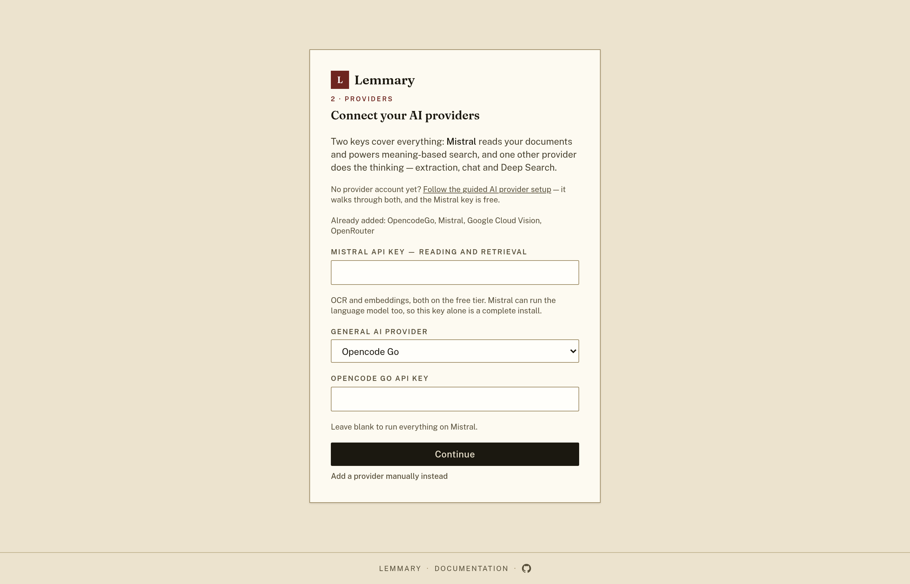

With a provider saved, the last step picks which model does what. The catalogue
is fetched from the provider, so the list is whatever your key can actually
reach.

## Signing in

Password, [passkey](/passkeys) and [OAuth2](/oauth) sign-in sit on one screen.
The passkey button appears once any account on the instance has enrolled one;
the provider buttons appear for whatever is enabled in PocketBase.

Each account manages its own passkeys, one per device.

## The documents list

Cards carry what the AI extracted: title, document type, correspondent, summary
and tags, with the processing status and the document's own date. The timeline
down the left side counts documents per year and month.

Full-text search runs over titles, OCR text, tags, purposes and summaries
through a Bleve index.

Document type and correspondent are typeahead filters built from the taxonomy
the extraction step created; tags narrow the same list and stack, and picking a
period in the timeline writes the date range. Every filter lives in the query
string, so a filtered list survives a reload and can be linked to.

Filtering to failed documents turns the cards into a selection, so a batch can
be queued for another attempt.

Everything reflows to one column on a narrow screen, with the header links —
and the less-travelled pages behind the gear menu — stacked behind the menu
button.

## Tags

A tag exists only once you create it here. Processing assigns from this list and
never invents anything, which is what keeps a library of 200 documents from
ending up with 200 tags. Applying a new tag to documents already in the archive
means reading them again, so the page prices that run before offering it.

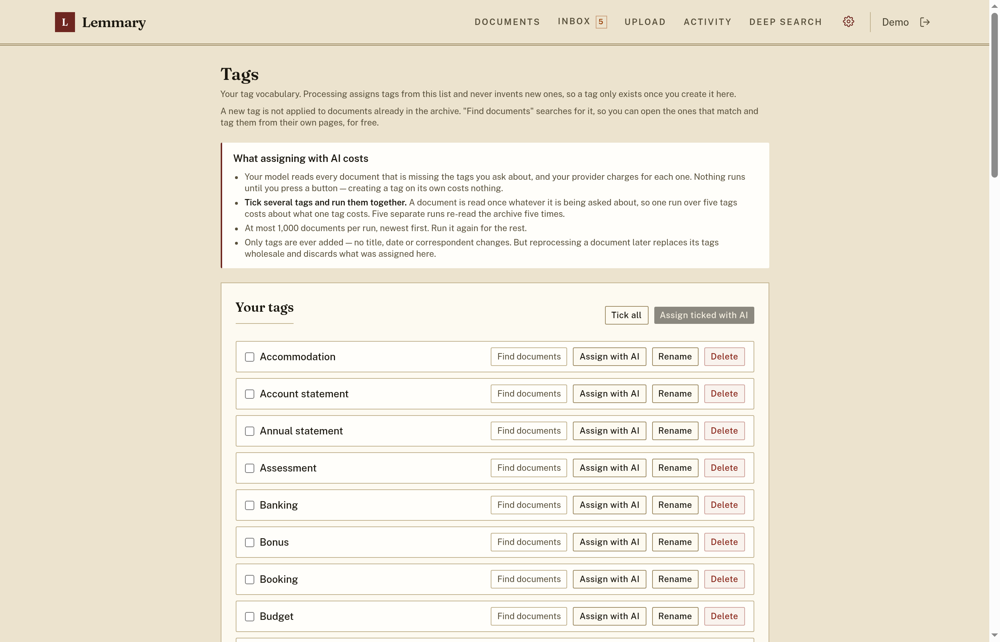

## The tray and the queue

With review always required, a finished document waits to be read rather than
joining the library unseen. The Inbox is that tray — waiting, still processing
and failed together — and the header carries what it holds.

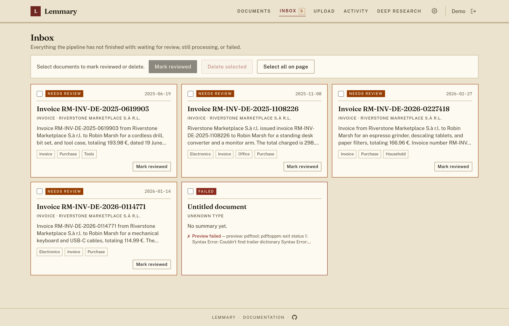

Activity is the queue itself: what the worker is doing now, with what is left to
do under it, and whatever was cancelled or failed in the last day still listed.

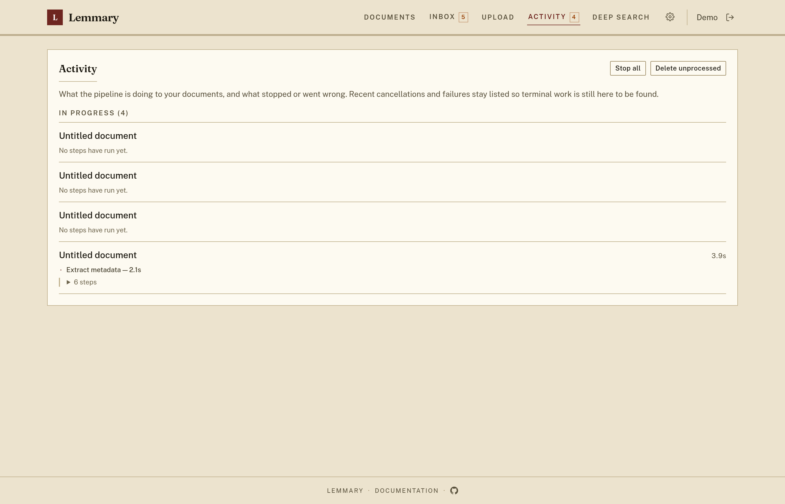

## One document

The detail page is where extraction gets reviewed. The file sits beside its
metadata -- a PDF in the browser's own viewer, so you can read page three while
correcting the fields it belongs to -- and the **Preview** button hides that
column when the fields need the width. Fields the model wrote in the document's
own language keep the original underneath the translation, so a German invoice
reads in English without losing what it actually said.

**Unlock editing** turns those fields into a form. Corrections are saved back
onto the document, and the taxonomy follows: a new type or correspondent typed
here is created and reused from then on. Tags are different -- they are picked
from a list you keep under **Tags**, so the editor offers what exists rather
than creating one from whatever you type.

Every run is recorded step by step — preview, OCR, duplicate detection,
extraction, apply, embed — with the provider and model each step used.

When a step fails, the panel says which one and why, and offers exactly the
steps to re-run.

Ask AI answers questions about a single document, using its OCR text as the
context. The chat is saved.

## Adding documents

PDFs, images, plain text, CSV, Word and Excel. Text formats are read locally and
skip OCR entirely.

A network scanner is a source of its own: the page speaks eSCL to the device
over the LAN, so nothing is installed and no computer sits in between.

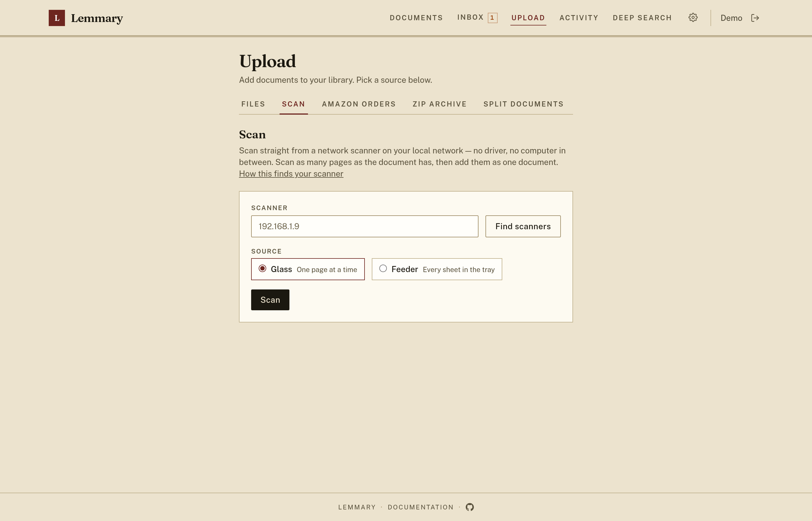

A zip you packed yourself is read before anything is created, folders inside it
kept as a name prefix.

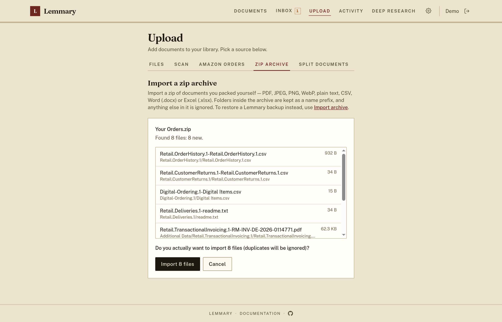

A scanner that produced one PDF from a stack of unrelated paper can be cut back
apart — by hand, or with the cuts the model proposes.

An Amazon "Your Orders" export is previewed before anything is created: how many
invoice PDFs it holds, how many are new, and how many of its other files are
being ignored.

## AI search and research

Two pages, two ways in. **AI assisted search**, reached from the document
list, finds documents and lists them as cards.

**Deep Research**, the header entry, reads what it found, counts and totals
across the archive, and writes an answer that links to its sources.

The steps it took stream in while the run is live and collapse behind a summary
when it finishes, so a long run stays legible.

An answer worth keeping can be branched: the fork copies the chat up to that
answer and carries on there, leaving the original as it was. Chats are saved,
listed in the sidebar and resumable by URL.

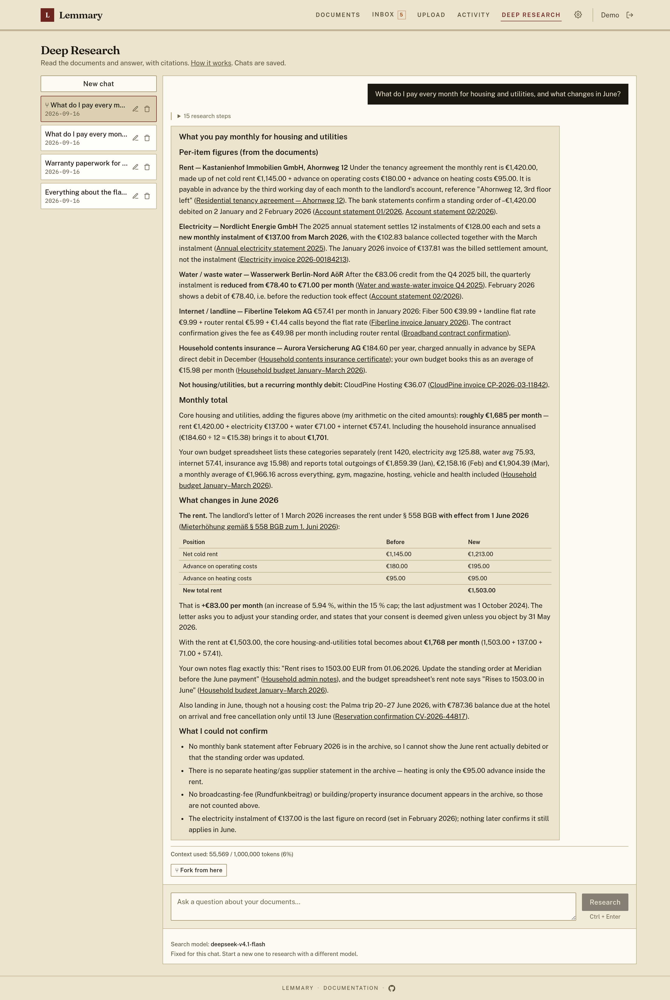

## Backup, restore and migration

The whole library — original files, OCR text, metadata, thumbnails and taxonomy
— downloads as one zip.

That zip restores into this instance or another one. It is previewed first, and
documents already present are skipped, so restoring twice is safe. Restoring
"as it was" sends nothing to OCR or the AI provider.

An existing paperless-ngx server can be pulled across directly, either keeping
its metadata or re-running the pipeline over the files.

## Administration

Settings are runtime configuration, stored in the database rather than the
environment, and split into a tab each. Appearance names the instance and picks
the accent the whole interface takes.

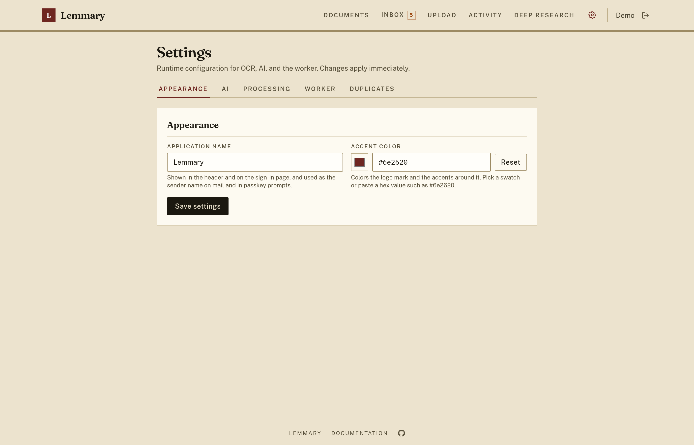

AI holds the providers and which model does what. API keys are write-only: the
page reports that a key is set, never what it is.

Processing covers the timeouts, the language results come back in, whether every
document waits for review, and house rules appended to the extraction prompt —
the place to say that "Rechnung" is an invoice, or that these three senders are
the same company.

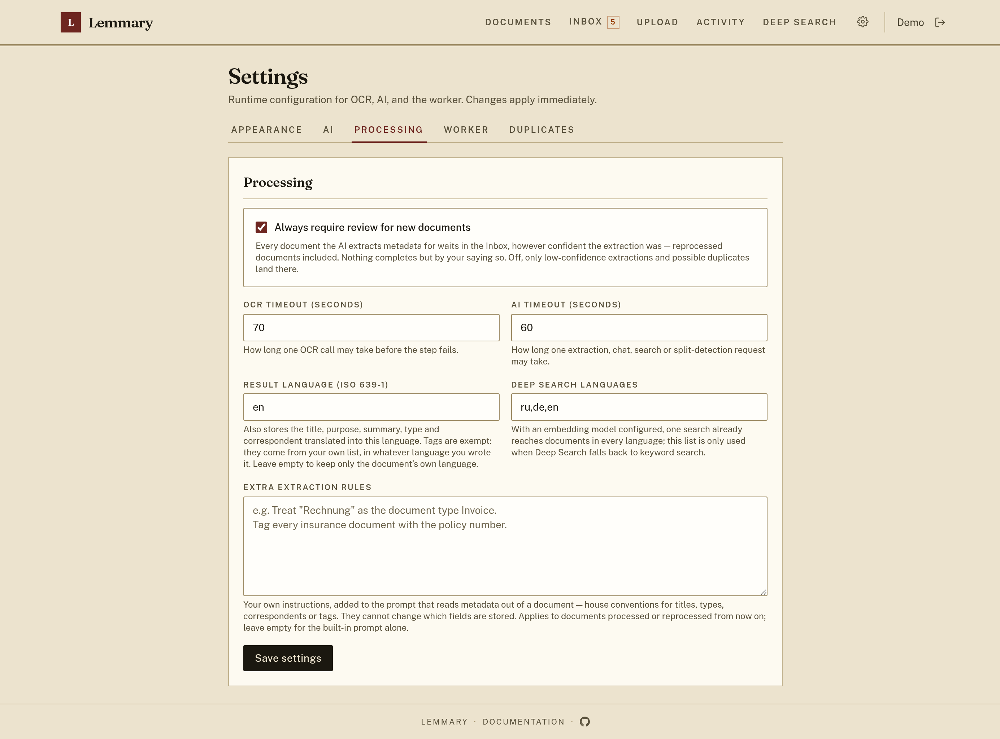

The worker's own limits: how long one job may run, and how often a failed step
is retried.

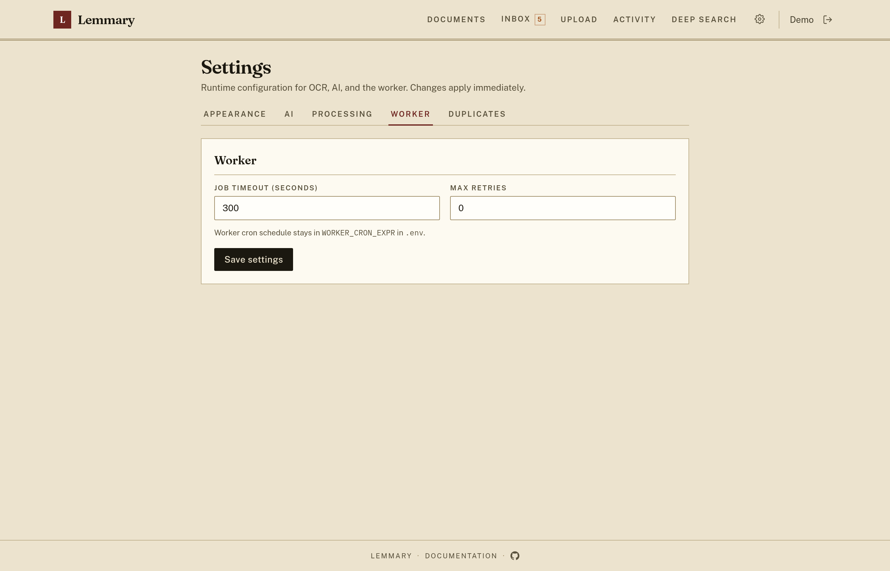

Exact duplicates are always refused on upload. Near-duplicate matching compares
OCR text instead, which costs a pass over the library, so it is off until asked
for.

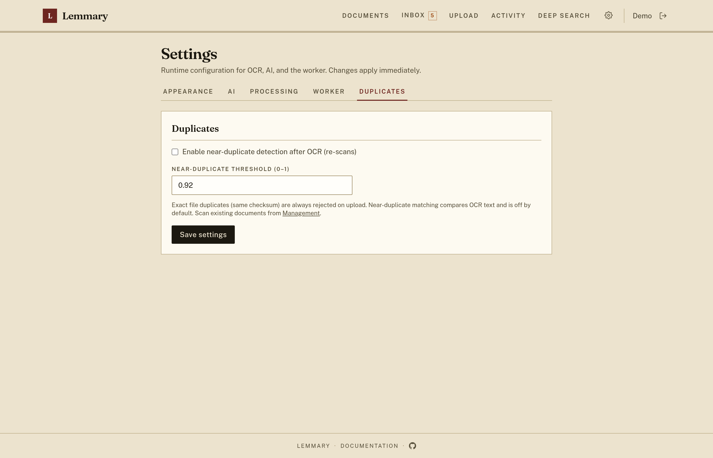

Library-wide maintenance: reprocess failed documents in batches, scan for
duplicates, delete taxonomy nothing points at any more, rebuild the search
index, and embed whatever is missing a vector.

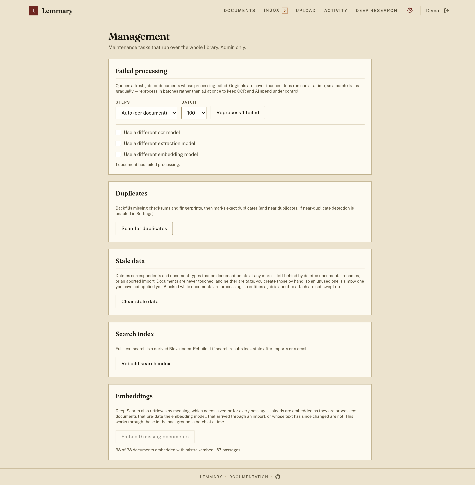

A scratch page for checking a provider and model against one file, without
creating a document.

